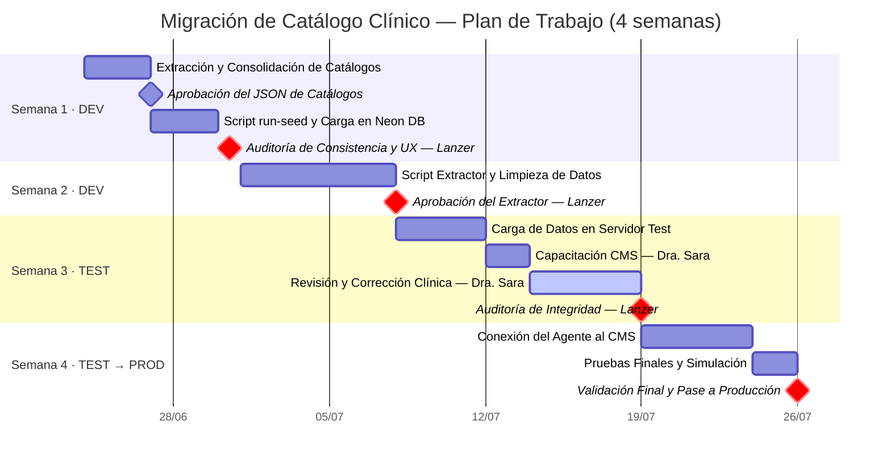

# Plan de Trabajo: Migración de Catálogo Clínico a Payload CMS
**Desarrolladora Jr:** Lucinda  
**Arquitecto / Validador Técnico:** Lanzer  
**Validadora Clínica:** Dra. Sara  

Este plan detalla las actividades planificadas para un período de 1 mes (4 semanas) con el fin de migrar la base de conocimientos clínicos (66 fichas de productos comerciales) desde archivos de texto plano a un sistema de gestión centralizado (Payload CMS) basado en bases de datos relacionales, y conectar el agente conversacional a esta nueva estructura.

---

## Entornos del Proyecto
Para garantizar la estabilidad y la calidad de la información, el desarrollo se ejecutará a través de tres entornos:
1. **Dev (Desarrollo):** Entorno local donde Lucinda creará las bases de datos y la estructura del sistema.
2. **Test (Pruebas):** Servidor de pruebas donde se subirá la información migrada para que la Dra. Sara realice la validación clínica y reciba capacitación.
3. **Producción:** Entorno final donde el agente consultará la información depurada y aprobada para atender a los usuarios.

---

## Fases y Actividades del Cronograma

### Semana 1: Estructuración y Carga Inicial de Catálogos (Entorno Dev)
* **Objetivo:** Definir la tipología estática de productos con la dirección clínica y poblar las tablas maestras (catálogos) en Neon DB usando extracción asistida por IA para garantizar la integridad referencial antes de la ingesta masiva.
* **Actividades de Lucinda:**
  - **Definición de Tipos de Producto:** Colaborar con la Dra. Sara para definir la lista cerrada y estática de `productType` (ej. liofilizados, líquidos, hilos PDO, insumos, etc.) y actualizar la colección `Products.ts` en el código de Payload.
  - **Diseño del Prompt de Extracción:** Crear el archivo `src/scripts/seed/prompt_extraccion.txt` con las instrucciones del prompt one-shot.
  - **Extracción de Catálogos:** Ejecutar el prompt contra la base de conocimientos legacy (`faq-agent/apps/agent/lib/data/catalogs` y `/real-products`) para extraer todos los valores únicos de laboratorios, ingredientes activos, zonas de aplicación, vías de administración, técnicas de aplicación, contraindicaciones y efectos adversos.
  - **Consolidación de Datos Semilla:** Guardar el resultado extraído en formato JSON consolidado dentro de `src/scripts/seed/` para su revisión.
  - **Desarrollo del Script de Carga:** Crear y ejecutar `src/scripts/seed/run-seed.ts` para insertar los catálogos aprobados en la base de datos relacional Postgres usando la API local de Payload.
* **Puertas de Calidad (Validación Técnica e Integridad):**
  - **Puerta 1.1 (Validación del JSON de Catálogos - Dra. Sara & Lanzer):** Revisión y aprobación humana de los listados únicos extraídos en los JSON intermedios para asegurar que no haya omisiones ni nombres duplicados antes de la carga física.
  - **Puerta 1.2 (Auditoría de Base de Datos y UX - Lanzer):** Verificación técnica de la correcta persistencia de las colecciones maestras en Neon DB y auditoría visual en el panel `/admin` de Payload para garantizar que las relaciones de los productos se rendericen correctamente.

---

### Semana 2: Preparación y Extracción de Información (Entorno Dev)
* **Objetivo:** Leer de forma automatizada las 66 fichas clínicas de origen y estructurarlas en formato digital limpio, detectando inconsistencias automáticamente.
* **Actividades de Lucinda:**
  - Desarrollar un script extractor de datos que lea las fichas comerciales existentes en formato de texto.
  - Implementar reglas de limpieza estricta (estandarización de nombres en mayúsculas y formateo uniforme).
  - Configurar marcas de advertencia automática: si a un producto le falta información crítica para la dosificación, el sistema lo etiquetará automáticamente como `"Requiere Revisión Clínica"` para que no se publique por error.
* **Puerta de Calidad (Validación Técnica - Lanzer):**
  - Revisión del código del extractor y validación de una muestra de datos estructurados para asegurar que no haya pérdida de información ni alteración de datos médicos.

---

### Semana 3: Carga de Datos, Capacitación y Validación Clínica (Entorno Test)
* **Objetivo:** Cargar la información estructurada en el entorno de pruebas, capacitar a la Dra. Sara y realizar la revisión médica de las 66 fichas.
* **Actividades de Lucinda:**
  - Desarrollar un script cargador que inserte la información en el CMS del entorno de Test de forma segura, enlazando correctamente las relaciones (ej. asociar cada producto a su respectivo laboratorio e ingrediente activo).
  - **Capacitación a la Dra. Sara:** Acompañar y capacitar a la doctora en el uso de la interfaz del CMS para que comprenda cómo revisar y corregir datos directamente en los formularios visuales.
* **Hito de Negocio (Validación Clínica - Dra. Sara):**
  - La Dra. Sara validará uno a uno los 66 productos cargados. Si encuentra información errónea o incompleta, la corregirá directamente sobre el formulario del CMS. Los productos aprobados pasarán al estado `"Aprobado para el Agente"`.
* **Puerta de Calidad (Validación Técnica - Lanzer):**
  - Verificación final de la base de datos en Test tras la limpieza clínica para garantizar la integridad de las relaciones y evitar registros duplicados.

---

### Semana 4: Conexión del Agente Inteligente y Pruebas Finales (Entornos Test a Producción)
* **Objetivo:** Conectar el agente de chat al nuevo sistema de contenidos en lugar de leer archivos de texto, y desplegar la solución a producción.
* **Actividades de Lucinda:**
  - Modificar el motor de búsqueda del agente de chat clínico para que consulte la base de datos a través de la API del CMS en lugar de los archivos de texto antiguos.
  - Implementar un filtro de seguridad estricto para que el agente de chat **solo** lea la información que fue explícitamente marcada como `"Aprobado para el Agente"` por la Dra. Sara.
  - Realizar pruebas de extremo a extremo para asegurar que el agente responda correctamente.
  - Desplegar la base de datos y la aplicación final al entorno de **Producción**.
* **Puerta de Calidad (Validación Técnica - Lanzer):**
  - Pruebas finales de comportamiento del agente y aprobación técnica del despliegue a producción.

---

## Diagrama de Gantt del Proyecto

