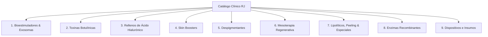

# Extracción y Mapeo Clínico Estructurado de Productos Faltantes

Este documento consolida la extracción clínica exhaustiva de todos los productos que **no se encuentran cargados en la base de datos local** de Payload CMS. 

La información ha sido recopilada, contrastada y estructurada rigurosamente combinando **dos fuentes oficiales obligatorias**:
1. **Fichas Técnicas Individuales** (`real-products/*.md`).
2. **Guías Clínicas e Índices de Catálogo** (`catalogs/indices/*.md`).

> [!IMPORTANT]
> **Metodología de Extracción:**
> - **Registros Heredados del Catálogo:** Mecanismos de acción globales, protocolos base, vías y técnicas estándar, advertencias de seguridad, contraindicaciones transversales y cuidados posteriores definidos a nivel de colección.
> - **Registros Únicos de la Ficha Técnica:** Formulaciones específicas, concentraciones, protocolos de reconstitución/dilución, dosis exactas, calibres recomendados, tiempos de latencia y duración, advertencias particulares e interacciones medicamentosas.
> - **Cero Invención de Datos:** Cualquier dato no especificado en las fuentes permanece omitido conforme a las directrices clínicas del proyecto.

---

## 📊 Estado Actual del Catálogo Local

| Métrica | Cantidad | Detalle |
| :--- | :---: | :--- |
| **Productos Cargados en BD Local** | **46** | Ingeridos en la base de datos Postgres / Payload CMS |
| **Fichas Técnicas en `real-products/`** | **64** | Total de archivos `.md` de fichas individuales |
| **Productos Faltantes de `real-products/`** | **18** | Identificados en fichas individuales pero pendientes en BD |
| **Productos / Insumos Adicionales de Catálogos** | **8** | Identificados en índices clínicos (insumos, variantes y cócteles) |
| **Total de Ítems Documentados en este Informe** | **26** | Organizados en 9 colecciones clínicas |

---

## 📑 Listado General de Productos Faltantes por Colección

| # | Producto / Ítem Canónico | Colección Clínica | Tipo de Producto | Laboratorio / Origen | Fuente Principal |
| :-: | :--- | :--- | :--- | :--- | :--- |
| **1** | `REJUBELLA` (`REJUBELLA-EX`) | Bioestimuladores y Exosomas | Liofilizado | Metabiomed, Corea del Sur | `REJUBELLA.md` + Catálogo |
| **2** | `ULTRA CA+` | Bioestimuladores y Exosomas | Líquido / Gel | Cosmoderma Inc, Corea del Sur | `ULTRA CA+.md` + Catálogo |
| **3** | `ULTRAGEN X` | Bioestimuladores y Exosomas | Liofilizado + Solución | Cosmoderma Inc, Corea del Sur | `ULTRAGEN X.md` + Catálogo |
| **4** | `WIZTOX` | Toxinas Botulínicas | Liofilizado | Wizmedi, Corea del Sur | `WIZTOX.md` + Catálogo |
| **5** | `THE BLACK` | Toxinas Botulínicas | Liofilizado | Wizmedi / Maypharm, Corea del Sur | `THE BLACK.md` + Catálogo |
| **6** | `SOFIDERM 1ml` (*Lines*, *Derm*, *Deep*) | Rellenos de Ácido Hialurónico | Gel reticulado | Techderm, China | `SOFIDERM 1ml.md` + Catálogo |
| **7** | `SOFIDERM 2ml` (*Derm Sub-Skin*) | Rellenos de Ácido Hialurónico | Gel reticulado | Techderm, China | `SOFIDERM 2ml.md` + Catálogo |
| **8** | `ULTRAFILL` (*Fine*, *Deep*, *Shape*) | Rellenos de Ácido Hialurónico | Gel reticulado | Cosmoderma Inc, Corea del Sur | `ULTRAFILL.md` + Catálogo |
| **9** | `ULTRAFILL KISS` | Rellenos de Ácido Hialurónico | Gel reticulado | Cosmoderma Inc, Corea del Sur | `ULTRAFILL KISS.md` + Catálogo |
| **10** | `ULTRAFILL NOSE` | Rellenos de Ácido Hialurónico | Gel reticulado | Cosmoderma Inc, Corea del Sur | `ULTRAFILL NOSE.md` + Catálogo |
| **11** | `ULTRA BODY` | Rellenos de Ácido Hialurónico | Gel corporal | Cosmoderma Inc, Corea del Sur | `ULTRA BODY.md` + Catálogo |
| **12** | `WIZFILL PLUS` (*No. 1*, *No. 2*, *No. 3*) | Rellenos de Ácido Hialurónico | Gel reticulado | Wizmedi, Corea del Sur | `WIZFILL PLUS.md` + Catálogo |
| **13** | `SOFIDERM SKIN BOOSTER` (*Resurrection*, *Wrinkle Fighter*) | Skin Boosters | Líquido / Gel fluido | Techderm, China | `SOFIDERM SKIN BOOSTER.md` + Catálogo |
| **14** | `NCTF` (`FILORGA NCTF 135 HA`) | Skin Boosters | Líquido | Fillmed / Filorga, Francia | `Skin boosters.md` (Catálogo) |
| **15** | `WHITENING` (`PROF WHITENING`) | Mesoterapia Despigmentante | Líquido | Laboratorio MCCM, España | `WHITENING.md` + Catálogo |
| **16** | `SKIN REPAIR` | Mesoterapia Regenerativa | Líquido | Laboratorio MCCM, España | `SKIN REPAIR.md` + Catálogo |
| **17** | `DMAE` (MCCM 3%) | Mesoterapia Regenerativa | Líquido | Laboratorio MCCM, España | `regenerativos.md` (Catálogo) |
| **18** | `VITAMINA A` | Mesoterapia Regenerativa | Líquido | Laboratorio MCCM, España | `regenerativos.md` (Catálogo) |
| **19** | `VNS` | Lipolíticos y Reductores | Líquido | Laboratorio de Corea del Sur | `VNS.md` + Catálogo |
| **20** | `SOONSU SHINING PEEL` | Peeling Químico | Líquido bifásico | Laboratorio de Corea del Sur | `SOONSU SHINING PEEL.md` + Catálogo |
| **21** | `WICKED SNOW WHITE` | Peeling y Blanqueamiento | Líquido / Gel | Laboratorio de Corea del Sur | `WICKED SNOW WHITE.md` |
| **22** | `CLH LIPASE COCKTAIL` | Enzimas Recombinantes | Líquido | Laboratorio MCCM / Especializado | `enzimas.md` (Catálogo) |
| **23** | `GLOWPEN PRO / DERMAPEN` | Dispositivos Médicos | Dispositivo electromecánico | No especificado | `Dermapen, agujas, aditamentos.md` |
| **24** | `CARTUCHOS DERMAPEN` (12, 36, Nano) | Insumos de Aplicación | Insumo descartable estéril | No especificado | `Dermapen, agujas, aditamentos.md` |
| **25** | `AGUJAS DE MESOTERAPIA` (32G, 30G, 27G, 26G) | Insumos de Aplicación | Insumo descartable estéril | No especificado | `Dermapen, agujas, aditamentos.md` |
| **26** | `CÁNULAS ESTÉTICAS` (18G, 21G, 25G, 27G) | Insumos de Aplicación | Insumo descartable estéril | No especificado | `Dermapen, agujas, aditamentos.md` |

---

# 🧬 DESGLOSE DETALLADO POR COLECCIÓN CLÍNICA



---

## 1. COLECCIÓN: Bioestimuladores, Biorevitalizadores y Exosomas

### 📋 Registros Heredados del Catálogo (`Bioestimuladores, biorevitalizador, exosomas.md`)
* **Mecanismo de Acción Global:** Inducción biológica de neocolagénesis (colágeno tipo I y III) y elastogénesis mediante estimulación de fibroblastos, reposición volumétrica estructural progresiva y regeneración celular mediante vesículas extracelulares (exosomas).
* **Vías y Técnicas Estándar:** Vía subdérmica / intradérmica profunda mediante técnica de abanico, microcánula o micropunción.
* **Contraindicaciones Compartidas:**
  - *Absolutas:* Hipersensibilidad a los componentes, procesos infecciosos o inflamatorios activos en la zona de punción, enfermedades autoinmunes activas, embarazo y lactancia.
  - *Relativas:* Enfermedades crónico-degenerativas descontroladas, pacientes bajo terapia anticoagulante o trastornos de coagulación.
* **Efectos Adversos Comunes:** Eritema localizado transitorio, edema leve a moderado, equimosis/hematomas en puntos de entrada, molestia o dolor leve.
* **Cuidados Post-Aplicación Compartidos:**
  - No masajear enérgicamente a menos que el protocolo del producto lo exija explícitamente.
  - Evitar exposición solar directa, saunas, vapor y ejercicio físico extenuante por 48 a 72 horas.
  - Uso estricto de protector solar FPS 50+.
* **Advertencia de Seguridad General:** Prohibido el uso de aparatología que genere calor profundo (radiofrecuencia, ultrasonido focalizado HIFU, ultracavitación, láser térmico) en las zonas tratadas durante las 4 a 12 semanas posteriores para evitar la degradación prematura del bioestimulador.

---

### 📦 1.1 REJUBELLA (`REJUBELLA-EX`)

* **Nombre Canónico:** `REJUBELLA`
* **Sinónimos / Aliases:** Rejubella-EX, Rejubella PDO, Bioestimulador Rejubella
* **Tipo de Producto:** Liofilizado (microesferas de Polidioxanona PDO)
* **Laboratorio y Origen:** Metabiomed, Corea del Sur
* **Descripción Clínica:** Relleno dérmico bioestimulador formulado a base de microesferas de polidioxanona (PDO) biocompatibles y reabsorbibles. Diseñado para atenuar arrugas leves a moderadas, restaurar la elasticidad cutánea, inducir neocolagénesis sostenida y producir un efecto lifting biológico sin aportar volumen excesivo.

#### Componentes y Presentación
* **Ingredientes Activos:** Microesferas de Polidioxanona (PDO) — 300 mg por vial (equivalente a 1436 hilos monofilamento de PDO).
* **Presentación Comercial:** Vial de 300 mg de polvo liofilizado estéril.
* **Almacenamiento y Conservación:** No requiere refrigeración previo a la reconstitución. Una vez reconstituido, conservar en refrigeración (2°C a 8°C) por un máximo estricto de 3 días.

#### Protocolo de Reconstitución y Dilución
* **Dilución Básica (1 zona del rostro):** Reconstituir con 5 mL de solución salina estéril inyectable (o agua estéril) + 1 mL de Lidocaína al 2% (Volumen total: 6 mL).
* **Hiperdilución (Rostro completo, cuello o escote):** Reconstituir con 10 mL de solución salina estéril + 1 mL de Lidocaína al 2% (Volumen total: 11 mL).
* **Tiempo de Hidratación:** Reposo previo a la aplicación para asegurar suspensión homogénea de las microesferas.

#### Protocolo Clínico de Aplicación
* **Zonas de Aplicación:** Rostro completo, tercio medio, tercio inferior, cuello, escote.
* **Vía de Administración:** Subdérmica.
* **Técnica de Aplicación:** Retroinyección lineal en abanico con microcánula.
* **Insumo Recomendado:** Cánula 25G x 50 mm.
* **Régimen de Tratamiento:** 1 a 2 sesiones. Se recomienda evaluar una 2ª sesión entre las 4 y 6 semanas.
* **Dinámica Temporal:**
  - *Inicio de Efectos Visibles:* Progresivo a partir de las 3 a 12 semanas (pico de colagénesis activa).
  - *Degradación del Polímero:* Las microesferas de PDO se degradan por hidrólisis en 6 a 8 meses.
  - *Durabilidad del Efecto Clínico:* Hasta 2 años gracias a la red de colágeno autólogo generado.

#### Seguridad Clínica Específica
* **Contraindicaciones Específicas:** Procesos inflamatorios locales, hipersensibilidad a la PDO, antecedentes de cicatrización hipertrófica o queloide.
* **Reacciones Adversas Particulares:** Enrojecimiento en el punto de abordaje, pequeños hematomas y leve edema transitorio.
* **Restricción Crítica:** No aplicar aparatología térmica (alta frecuencia, radiofrecuencia, ultracavitador, Body Up, HIFU) en el área tratada.

---

### 📦 1.2 ULTRA CA+

* **Nombre Canónico:** `ULTRA CA+`
* **Sinónimos / Aliases:** Ultra CA Plus, Ultra Ca, Hidroxiapatita de Calcio Ultra CA
* **Tipo de Producto:** Gel inyectable / Suspensión de Hidroxiapatita de Calcio
* **Laboratorio y Origen:** Cosmoderma Inc, Corea del Sur
* **Certificaciones:** Ministerio de Seguridad de Alimentos y Medicamentos de Corea (MFDS), Certificación GMP (Good Manufacturing Practices), Norma ISO 13485 (dispositivos médicos).
* **Descripción Clínica:** Dispositivo inyectable de tecnología dual a base de microesferas de Hidroxiapatita de Calcio (CaHA) sintética de última generación suspendidas en gel portador. Funciona de manera versátil como potente bioestimulador de colágeno o como generador de soporte estructural y volumen inmediato según el protocolo de dilución y plano anatómico.

#### Componentes y Presentación
* **Ingredientes Activos:** Hidroxiapatita de Calcio (CaHA) — Concentración 300 mg/mL.
* **Presentación Comercial:** Caja con 2 jeringas prellenadas de 0.8 mL c/u + 1 llave de tres vías esterilizada incluida para mezcla.
* **Insumo Requerido (no incluido):** Cánula 25G x 50 mm.

#### Protocolo de Preparación (Tecnología Dual)
1. **Modalidad Bioestimulador (Efecto Lifting & Regeneración Dérmica):**
   - Conectar una jeringa de 5 mL con solución salina estéril al 0.9% en un puerto de la llave de 3 vías.
   - Opcional: Agregar 0.2 mL de Lidocaína al 2% por cada jeringa de producto para confort del paciente.
   - Conectar la jeringa de Ultra CA+ en el puerto opuesto.
   - Realizar 20 a 30 pases bidireccionales continuos hasta lograr una emulsión lechosa homogénea.
2. **Modalidad Volumetría y Soporte Estructural (Marcaje Mandibular / Mentón):**
   - Aplicación directa del gel sin diluir (o con adición mínima de 0.1 mL de lidocaína).

#### Protocolo Clínico de Aplicación
* **Zonas de Aplicación:** Rostro (mejillas, tercio medio, línea mandibular, mentón), cuello, dorso de manos.
* **Vías y Planos:** Subdérmico (bioestimulación) o supraperióstico / subcutáneo profundo (volumetría).
* **Técnica de Aplicación:** Abanico retrógrado con cánula 25G x 50 mm; bolos supraperiósticos en mentón/mandíbula.
* **Maniobra Obligatoria:** Masaje post-aplicación inmediato y firme para distribuir uniformemente las microesferas y prevenir nódulos o sobrecorrecciones.
* **Dinámica Temporal:**
  - *Inicio de Efectos:* Inmediato en volumetría; progresivo (4-8 semanas) en bioestimulación.
  - *Duración del Efecto:* Hasta 18 meses.

#### Seguridad Clínica Específica
* **Contraindicaciones:** Hipersensibilidad a la hidroxiapatita o gel portador, enfermedades crónico-degenerativas descontroladas, infecciones locales, embarazo y lactancia.
* **Efectos Adversos:** Inflamación de moderada a severa durante las primeras 24-48 horas, dolor leve, eritema y posibles hematomas en puntos de entrada.

---

### 📦 1.3 ULTRAGEN X

* **Nombre Canónico:** `ULTRAGEN X`
* **Sinónimos / Aliases:** Ultragen-X, Exosomas Ultragen, Ultragen Centella
* **Tipo de Producto:** Liofilizado + Solución Activadora (Kit dual)
* **Laboratorio y Origen:** Cosmoderma Inc, Corea del Sur
* **Descripción Clínica:** Tratamiento biorevitalizante y regenerativo avanzado formulado a base de exosomas de origen vegetal derivados de *Centella asiatica* purificados mediante tecnología de filtración tangencial, combinados con un complejo activador de PDRN, péptidos biomiméticos, ácido hialurónico y niacinamida. Potencia la regeneración celular, repara la barrera cutánea dañada y mejora la textura y luminosidad dérmica.

#### Componentes y Presentación
* **Vial 1 (Liofilizado):** Exosomas de *Centella asiatica* — 40 mg.
* **Vial 2 (Solución Activadora):** 5 mL con Polidesoxirribonucleótido (PDRN), Ácido Hialurónico, Niacinamida y Complejo Multipeptídico.
* **Presentación Comercial:** Kit de 2 viales (Vial 1 polvo liofilizado + Vial 2 solución líquida activadora de 5 mL).

#### Protocolo de Reconstitución y Aplicación
* **Reconstitución:** Extraer los 5 mL de la solución activadora (Vial 2) con aguja estéril e introducirlos lentamente en el vial de liofilizado (Vial 1). Mezclar con movimientos circulares suaves sin agitar bruscamente para preservar la integridad vesicular.
* **Vía y Técnicas:** Intradérmica (Mesoterapia clásica pápula a pápula o Microneedling / Dermapen a 0.5 mm - 1.0 mm de profundidad).
* **Zonas de Aplicación:** Rostro, cuello, escote, cicatrices atróficas o zonas post-procedimiento ablativo.
* **Régimen de Tratamiento:** 3 a 5 sesiones con intervalos de 2 a 3 semanas.
* **Efectos Clínicos:** Reparación de barrera, hidratación profunda, reducción del tamaño del poro, cicatrización acelerada.

---

## 2. COLECCIÓN: Toxinas Botulínicas (Neurotoxinas Tipo A)

### 📋 Registros Heredados del Catálogo (`toxinas.md`)
* **Mecanismo de Acción Global:** Neurotoxina derivada de *Clostridium botulinum* Tipo A. Bloquea de forma selectiva y reversible la liberación de acetilcolina en la placa neuromuscular al escindir la proteína SNAP-25 del complejo SNARE, produciendo relajación muscular y atenuación de arrugas hipercinéticas.
* **Presentación y Pureza Estándar:** 100 UI liofilizadas con albúmina sérica humana y NaCl. Complejo proteico de 900 kDa con pureza > 99%.
* **Almacenamiento Estricto:** Cadena de frío constante entre 2°C y 8°C. Prohibido congelar. Caducidad 36 meses sin reconstituir.
* **Tabla de Reconstitución Universal:**
  | Diluyente (Sol. Salina 0.9% estéril) | Concentración por 0.1 mL |
  | :---: | :---: |
  | **1.0 mL** (Recomendada / Estándar) | **10.0 UI / 0.1 mL** |
  | **2.0 mL** | **5.0 UI / 0.1 mL** |
  | **2.5 mL** | **4.0 UI / 0.1 mL** |
  | **4.0 mL** | **2.5 UI / 0.1 mL** |
* **Protocolo de Reconstitución:** Inyectar la solución salina refrigerada lentamente por las paredes del vial para evitar choque térmico o formación de espuma/turbulencia que desnaturalice la toxina. No agitar vigorosamente.
* **Zonas de Aplicación:** Líneas glabelares (entrecejo), músculo frontal (frente), región periocular (patas de gallo), bunny lines (nariz), tercio inferior (mentón en empedrado, comisuras orales), bandas platismales (cuello), maseteros (bruxismo/afinamiento facial), hiperhidrosis axilar/palmar.
* **Contraindicaciones Absolutas Compartidas:**
  - Hipersensibilidad a la toxina botulínica, albúmina sérica humana o componentes de la fórmula.
  - Enfermedades neuromusculares: Miastenia Gravis, Síndrome de Lambert-Eaton, Esclerosis Lateral Amiotrófica (ELA).
  - Infección o inflamación activa en los puntos de inyección propuestos.
  - Embarazo y lactancia.
* **Interacciones Medicamentosas Críticas:**
  - Potenciación del bloqueo neuromuscular: Aminoglucósidos (gentamicina, amikacina), sulfato de magnesio, quinina, bloqueadores neuromusculares no despolarizantes.
  - Fármacos anticolinérgicos: Potenciación del efecto sistémico.
  - Precaución con polimixina, tetraciclinas y lincomicina.
* **Cuidados Post-Aplicación Obligatorios (Primeras 4 a 6 horas):**
  - Mantener posición erguida (no acostarse ni inclinarse hacia adelante).
  - No masajear ni frotar la zona tratada para evitar difusión no deseada del fármaco (riesgo de ptosis palpebral).
  - Evitar ejercicio intenso, exposición solar directa, saunas y consumo de alcohol durante 24 horas.

---

### 📦 2.1 WIZTOX

* **Nombre Canónico:** `WIZTOX`
* **Sinónimos / Aliases:** Wiztox 100 UI, Toxina Wiztox, Wizmedi Wiztox
* **Tipo de Producto:** Liofilizado (Neurotoxina inyectable)
* **Laboratorio y Origen:** Wizmedi Co., Ltd., Corea del Sur
* **Certificaciones:** Aprobada por el Ministerio de Seguridad de Alimentos y Medicamentos de Corea (MFDS).
* **Descripción Clínica:** Toxina botulínica Tipo A purificada al 99.98% de alta estabilidad formulada con tecnología de deshidratación al vacío de residuo ultrafino, lo que le confiere una apariencia casi imperceptible en el fondo del vial y una excelente resistencia a la degradación dentro de la cadena de frío.

#### Componentes y Presentación
* **Composición por Vial:**
  - *Clostridium botulinum* Tipo A: 100 UI
  - Albúmina sérica humana (estabilizante): 0.5 mg
  - Cloruro de sodio (isotonicidad): 0.9 mg
* **Peso Molecular:** 900 kDa | **Pureza:** 99.98%.
* **Conservación tras Reconstitución:** Uso preferente dentro de las primeras 24 horas; estabilidad demostrada de 7 a 10 días bajo refrigeración estricta (2°C - 8°C).

#### Protocolo Clínico
* **Reconstitución Recomendada:** 1.0 mL de solución salina estéril al 0.9% refrigerada (10 UI por 0.1 mL).
* **Calibre y Aguja:** Aguja hipodérmica 31G x 6 mm o jeringa de insulina ultra fina.
* **Dosis Habitual:** 1 a 4 UI por punto de inyección según anatomía y tono muscular individual.
* **Dinámica Temporal:**
  - *Inicio de Efectos Visibles:* 5 a 7 días post-aplicación.
  - *Pico de Acción:* 14 días.
  - *Duración del Efecto:* 3 a 6 meses (promedio clínico habitual: 4 a 6 meses).

---

### 📦 2.2 THE BLACK

* **Nombre Canónico:** `THE BLACK`
* **Sinónimos / Aliases:** The Black Botulinum Toxin, Toxina The Black, The Black 100 UI
* **Tipo de Producto:** Liofilizado (Neurotoxina inyectable)
* **Laboratorio y Origen:** Wizmedi / Maypharm, Corea del Sur
* **Certificaciones:** KFDA / MFDS (Corea del Sur).
* **Descripción Clínica:** Toxina botulínica Tipo A de nueva generación con pureza certificada del 99.98% y ultra purificación proteica que minimiza la presencia de proteínas complejas inactivas, reduciendo drásticamente el riesgo de formación de anticuerpos neutralizantes y resistencia terapéutica a largo plazo.

#### Componentes y Presentación
* **Composición por Vial:**
  - *Clostridium botulinum* Tipo A: 100 UI
  - Albúmina sérica humana: 0.5 mg
  - Cloruro de sodio: 0.9 mg
* **Peso Molecular:** 900 kDa | **Pureza:** 99.98%.
* **Presentación:** Vial liofilizado al vacío con apariencia translúcida de residuo mínimo.

#### Protocolo Clínico
* **Reconstitución:** 1.0 mL de solución salina al 0.9% (10 UI/0.1 mL).
* **Insumo:** Aguja 30G - 31G x 4mm o 6mm.
* **Dosis por Punto:** 2 a 4 UI según grupo muscular.
* **Dinámica Temporal:** Inicio visible entre el día 5 y 7; duración de 4 a 6 meses.

---

## 3. COLECCIÓN: Rellenos de Ácido Hialurónico (Dérmicos y Corporales)

### 📋 Registros Heredados del Catálogo (`rellenos.md`)
* **Mecanismo de Acción Global:** Gel viscoelástico estéril, apirógeno y transparente de Ácido Hialurónico reticulado (BDDE) de origen biosintético. Actúa reponiendo volumen tisular perdido, corrigiendo surcos y depresiones, perfilando estructuras faciales/corporales e hidratando la matriz extracelular.
* **Clasificación por Densidad y Reología:**
  - *Baja Densidad (Fine/Lines):* Líneas finas, arrugas superficiales, ojeras. Plano dérmico superficial a medio.
  - *Media Densidad (Derm/Deep facial/Kiss):* Surcos nasogenianos, líneas de marioneta, aumento y perfilado labial. Plano dérmico medio a subcutáneo.
  - *Alta Densidad (Shape/Sub-Skin/Nose/No. 3):* Rinomodelación, proyección de mentón, ángulo mandibular, pómulos. Plano subcutáneo profundo a supraperióstico.
  - *Corporal (Ultra Body / Deep 2ml):* Voluminización de glúteos, cadera, pantorrillas y depresiones corporales. Plano subdérmico/subcutáneo profundo con cánula.
* **Contraindicaciones Absolutas Compartidas:**
  - Hipersensibilidad al Ácido Hialurónico, lidocaína o agentes reticulantes (BDDE).
  - Presencia de procesos inflamatorios o infecciosos en el sitio de inyección (acné activo, herpes simple).
  - Embarazo y período de lactancia.
  - Antecedentes de enfermedades autoinmunes severas o síndrome de hipersensibilidad a implantes dérmicos.
* **Efectos Adversos Comunes:** Edema inflamatorio transitorio (24-72 h), eritema, equimosis/hematomas, dolor local a la palpación.
* **Complicación Crítica:** Riesgo de compromiso vascular por oclusión o compresión arterial. Requiere aspiración previa a la inyección y disponibilidad inmediata de Hialuronidasa inyectable en cabina.
* **Cuidados Post-Aplicación:** No aplicar maquillaje en las primeras 12 horas; evitar saunas, piscinas, ejercicio intenso y exposición térmica extrema durante 48 horas; no realizar masajes agresivos no indicados.

---

### 📦 3.1 SOFIDERM 1ml (*Lines*, *Derm*, *Deep*)

* **Nombre Canónico:** `SOFIDERM 1ml`
* **Sinónimos / Aliases:** Sofiderm Facial, Sofiderm Lines, Sofiderm Derm, Sofiderm Deep 1ml
* **Tipo de Producto:** Gel inyectable reticulado
* **Laboratorio y Origen:** Techderm, China
* **Certificaciones:** Marcado CE, MDSAP (Medical Device Single Audit Program), ISO 9001, ISO 13485.
* **Descripción Clínica:** Línea completa de ácido hialurónico monofásico reticulado inteligente con lidocaína incorporada, caracterizada por su alta viscoelasticidad, excelente biocompatibilidad, facilidad de extrusión y baja tasa de degradación enzimática.

#### Componentes Comunes
* **Ácido Hialurónico Reticulado:** Concentración 20 mg/mL.
* **Lidocaína Clorhidrato:** 3 mg/mL (0.3%) para máximo confort analgésico durante la infiltración.

#### Desglose de Presentaciones Comerciales (Variantes)
1. **Sofiderm Lines (Finelines):**
   - *Presentación:* Jeringa precargada de 1.0 mL + 2 agujas 27G x 1/2" (o 30G x 13mm).
   - *Indicaciones:* Líneas finas periorbitales, patas de gallo, arrugas peribucales, ojeras superficiales.
   - *Plano de Inyección:* Dermis superficial a media.
   - *Durabilidad:* 6 a 9 meses.
2. **Sofiderm Derm:**
   - *Presentación:* Jeringa precargada de 1.0 mL + 2 agujas 27G x 1/2".
   - *Indicaciones:* Surcos nasogenianos moderados, líneas de marioneta, labios (perfilado y volumen), frente y mejillas.
   - *Plano de Inyección:* Dermis media a subcutánea.
   - *Durabilidad:* 9 a 12 meses.
3. **Sofiderm Deep (1 mL):**
   - *Presentación:* Jeringa precargada de 1.0 mL + 1 aguja 27G x 1/2" y 1 aguja 25G x 5/8" (o microcánula).
   - *Indicaciones:* Surcos profundos, pómulos, mentón, marcaje mandibular, rinomodelación y pérdida de volumen facial severa.
   - *Plano de Inyección:* Subcutáneo profundo / Supraperióstico.
   - *Durabilidad:* 12 a 18 meses.

---

### 📦 3.2 SOFIDERM 2ml (*Derm Sub-Skin*)

* **Nombre Canónico:** `SOFIDERM 2ml`
* **Sinónimos / Aliases:** Sofiderm Derm Sub-Skin, Sofiderm Sub-Skin 2ml, Sofiderm Corporal
* **Tipo de Producto:** Gel inyectable reticulado de alta densidad
* **Laboratorio y Origen:** Techderm, China
* **Certificaciones:** Marcado CE, MDSAP, ISO 13485.
* **Descripción Clínica:** Gel de ácido hialurónico de ultra alta densidad y reticulación optimizada para la corrección de defectos volumétricos mayores, remodelación de contornos y relleno corporal o facial supraperióstico profundo.

#### Componentes y Presentación
* **Composición:** AH Reticulado 20 mg/mL + Lidocaína 3 mg/mL.
* **Presentación Comercial:** Jeringa de 2.0 mL prellenada con 2 agujas 23G (o apto para microcánula 18G/21G).
* **Zonas e Indicaciones:** Proyección de mentón y ángulo mandibular masivo, reconstrucción de volumen malar, modelado de glúteos, crestas ilíacas o cicatrices deprimidas profundas.
* **Plano de Inyección:** Tejido celular subcutáneo profundo, supraperióstico o subdérmico corporal.
* **Durabilidad Estimada:** 12 a 18 meses.

---

### 📦 3.3 ULTRAFILL (*Fine*, *Deep*, *Shape*)

* **Nombre Canónico:** `ULTRAFILL`
* **Sinónimos / Aliases:** Ultrafill Filler, Ultrafill Fine, Ultrafill Deep, Ultrafill Shape
* **Tipo de Producto:** Gel inyectable reticulado monofásico
* **Laboratorio y Origen:** Cosmoderma Inc, Corea del Sur
* **Certificaciones:** MFDS (Corea), Marcado CE, ISO 13485.
* **Tecnología de Fabricación:** HBCT (High Bond Cross-Linking Technology) que garantiza alta elasticidad (G'), cohesividad superior y mínimo residuo de BDDE libre (< 0.1 ppm).

#### Componentes Comunes
* **Ácido Hialurónico Reticulado:** Concentración 24 mg/mL.
* **Lidocaína Clorhidrato:** 3 mg/mL (0.3%).

#### Desglose de Variantes
1. **Ultrafill Fine:**
   - *Presentación:* Jeringa 1.0 mL con aguja 30G x 1/2".
   - *Indicaciones:* Líneas finas superficiales, arrugas periorbiculares y periorales, rejuvenecimiento de lóbulos.
   - *Plano de Inyección:* Dermis superficial a media.
   - *Duración:* 6 a 9 meses.
2. **Ultrafill Deep:**
   - *Presentación:* Jeringa 1.0 mL con aguja 27G x 1/2".
   - *Indicaciones:* Surcos nasogenianos, líneas de marioneta, aumento de labios y comisuras.
   - *Plano de Inyección:* Dermis media a profunda / Subcutáneo.
   - *Duración:* 9 a 12 meses.
3. **Ultrafill Shape:**
   - *Presentación:* Jeringa 1.0 mL con aguja 25G x 1/2" (o cánula 25G x 50 mm).
   - *Indicaciones:* Volumetría malar (pómulos), borde mandibular, mentón y corrección de fosa temporal.
   - *Plano de Inyección:* Subcutáneo profundo a supraperióstico.
   - *Duración:* 12 a 18 meses.

---

### 📦 3.4 ULTRAFILL KISS

* **Nombre Canónico:** `ULTRAFILL KISS`
* **Sinónimos / Aliases:** Ultrafill Lips, Ultrafill Kiss Labios
* **Tipo de Producto:** Gel inyectable reticulado específico
* **Laboratorio y Origen:** Cosmoderma Inc, Corea del Sur
* **Descripción Clínica:** Formulación exclusiva de ácido hialurónico optimizada mediante reología flexible y cohesividad media diseñada para la mucosa labial dinámica. Aporta volumen natural, definición del arco de Cupido, perfilado del borde bermellón e hidratación profunda sin sensación de rigidez ni nódulos.

#### Componentes y Presentación
* **Composición:** AH Reticulado 24 mg/mL + Lidocaína 0.3% (3 mg/mL).
* **Presentación:** Jeringa precargada de 1.0 mL con agujas ultra delgadas 27G / 30G.
* **Zonas de Aplicación:** Labio superior, labio inferior, borde bermellón, filtrum y comisuras labiales.
* **Plano de Aplicación:** Submucosa labial y plano intramuscular superficial.
* **Durabilidad Estimada:** 9 a 12 meses.

---

### 📦 3.5 ULTRAFILL NOSE

* **Nombre Canónico:** `ULTRAFILL NOSE`
* **Sinónimos / Aliases:** Ultrafill Rinomodelación, Ultrafill Nose Filler
* **Tipo de Producto:** Gel inyectable reticulado de ultra alta cohesividad
* **Laboratorio y Origen:** Cosmoderma Inc, Corea del Sur
* **Descripción Clínica:** Relleno de ácido hialurónico estructural de máxima firmeza viscoelástica (alto módulo de almacenamiento G') y mínima capacidad de hinchazón hidrofílica, formulado específicamente para rinomodelación no quirúrgica. Proporciona soporte rígido en el dorso nasal, proyección de la punta y rectificación del perfil sin migración lateral del producto.

#### Componentes y Presentación
* **Composición:** AH Reticulado 24 mg/mL + Lidocaína 0.3% (3 mg/mL).
* **Presentación:** Jeringa de 1.0 mL con aguja 25G / 27G o cánula.
* **Zonas:** Dorso nasal, espina nasal anterior, ángulo nasolabial y punta nasal.
* **Plano de Inyección:** Supraperióstico y suprapericóndrico estricto.
* **Duración:** 12 a 18 meses.
* **Advertencia de Seguridad:** Zona de alto riesgo vascular (arteria dorsal de la nariz y ramas angulares). Inyección retrógrada lenta en microbolos con aspiración previa mandatoria.

---

### 📦 3.6 ULTRA BODY

* **Nombre Canónico:** `ULTRA BODY`
* **Sinónimos / Aliases:** Ultra Body Filler, UltraBody Corporal, AH Corporal Ultra Body
* **Tipo de Producto:** Gel inyectable reticulado corporal
* **Laboratorio y Origen:** Cosmoderma Inc, Corea del Sur
* **Descripción Clínica:** Gel de ácido hialurónico altamente reticulado desarrollado para remodelación y aumento volumétrico corporal seguro y mínimamente invasivo. Permite esculpir glúteos, caderas, pantorrillas y corregir depresiones post-traumáticas o celulíticas severas con resultados inmediatos.

#### Componentes y Presentación
* **Composición:** Ácido Hialurónico reticulado de grado corporal — Concentración 20-24 mg/mL.
* **Presentación Comercial:** Caja de 60 mL (formato de 6 jeringas de 10 mL c/u).

#### Protocolo de Preparación y Aplicación Corporal
1. **Dilución:** En cada una de las 6 jeringas de 20 mL, incorporar 10 mL de Ultra Body + 10 mL de solución salina estéril al 0.9% (relación 1:1 para facilitar la dispersión y maleabilidad).
2. **Anestesia Local:** Infiltrar 1 mL de Lidocaína al 1% o 2% con epinefrina en el punto de entrada de la incisión. Esperar 3 minutos para vasoconstricción y anestesia completa.
3. **Abordaje:** Realizar punción de entrada con aguja piloto 18G.
4. **Infiltración:** Introducir microcánula corporal 18G x 70 mm en plano subdérmico/subcutáneo medio-profundo mediante técnica de abanico retrógrado continuo.
5. **Masaje:** Moldear la zona tratada inmediatamente al finalizar la sesión.
* **Dinámica Temporal:** Duración del efecto de 18 a 24 meses.

---

### 📦 3.7 WIZFILL PLUS (*No. 1*, *No. 2*, *No. 3*)

* **Nombre Canónico:** `WIZFILL PLUS`
* **Sinónimos / Aliases:** Wizfill, Wizfill Plus No. 1, Wizfill Plus No. 2, Wizfill Plus No. 3
* **Tipo de Producto:** Gel inyectable reticulado monofásico
* **Laboratorio y Origen:** Wizmedi Co., Ltd., Corea del Sur
* **Certificaciones:** MFDS / KFDA (Corea del Sur).
* **Descripción Clínica:** Gama coreana de implantes dérmicos formulados con ácido hialurónico estabilizado y lidocaína que emplea tecnología de reticulación multicapa para garantizar volumen uniforme, degradación simétrica y óptima integración tisular.

#### Componentes y Variantes
* **Composición General:** AH Reticulado 20-24 mg/mL + Lidocaína 0.3%. Jeringas de 1.0 mL.
1. **Wizfill Plus No. 1 (Soft):**
   - *Indicaciones:* Ojeras, líneas periorbitales, líneas de expresión superficiales.
   - *Aguja:* 30G. Dermis superficial. Duración: 6-9 meses.
2. **Wizfill Plus No. 2 (Mid):**
   - *Indicaciones:* Aumento de labios, surcos nasogenianos, arrugas moderadas.
   - *Aguja:* 27G. Dermis media a profunda. Duración: 9-12 meses.
3. **Wizfill Plus No. 3 (Hard):**
   - *Indicaciones:* Pómulos, mentón, línea mandibular, remodelación ósea.
   - *Aguja:* 25G / 27G. Subcutáneo profundo / Supraperióstico. Duración: 12-14 meses.

---

## 4. COLECCIÓN: Skin Boosters y Biorevitalizantes Dérmicos

### 📋 Registros Heredados del Catálogo (`Skin boosters.md`)
* **Mecanismo de Acción Global:** Hidratación profunda de la dermis mediante ácido hialurónico no reticulado/micro-reticulado altamente hidrofílico, combinado con biorevitalización tisular por péptidos biomiméticos, aminoácidos esenciales y antioxidantes que restauran la matriz extracelular.
* **Técnica de Aplicación Estándar:** Micropápulas dérmicas (nappage), multipunción o Microneedling (Dermapen) a 0.5-1.0 mm de profundidad.
* **Contraindicaciones:** Hipersensibilidad a componentes, procesos inflamatorios o infecciosos activos, embarazo y lactancia.
* **Efectos Adversos:** Micropápulas visibles durante 24-48 horas, eritema ligero, hematomas puntiformes.
* **Cuidados Post-Aplicación:** No lavar el rostro con agua caliente en 24 h; aplicar protector solar mineral; no usar maquillaje por 24 h.

---

### 📦 4.1 SOFIDERM SKIN BOOSTER (*Resurrection*, *Wrinkle Fighter*)

* **Nombre Canónico:** `SOFIDERM SKIN BOOSTER`
* **Sinónimos / Aliases:** Sofiderm Skinbooster, Sofiderm Resurrection, Sofiderm Wrinkle Fighter
* **Tipo de Producto:** Solución inyectable revitalizante
* **Laboratorio y Origen:** Techderm, China
* **Certificaciones:** Marcado CE, ISO 13485.
* **Descripción Clínica:** Tratamiento biorevitalizante dérmico avanzado disponible en dos formulaciones sinérgicas para la restauración del hidrobalance, atenuación de arrugas dinámicas finas y rejuvenecimiento cutáneo global.

#### Variantes Clínicas
1. **Sofiderm Resurrection (Hidratación & Luminosidad):**
   - *Composición:* Ácido Hialurónico no reticulado + Complejo de Aminoácidos y Vitaminas.
   - *Indicaciones:* Pieles fotoenvejecidas, opacas, deshidratadas y con pérdida de elasticidad.
   - *Protocolo:* Mesoterapia facial en micropápulas con aguja 30G-32G x 4mm o Dermapen. 3 sesiones cada 21 días.
2. **Sofiderm Wrinkle Fighter (Efecto Botox-Like Natural):**
   - *Composición:* Ácido Hialurónico + Argireline (Acetil Hexapéptido-8) + Péptidos Tensores.
   - *Mecanismo:* El Argireline desestabiliza el complejo SNARE (bloqueo competitivo de SNAP-25), atenuando la microcontracción muscular facial y relajando líneas de expresión sin paralizar la mímica facial.
   - *Indicaciones:* Líneas finas en frente, entrecejo, patas de gallo y cuello.

---

### 📦 4.2 NCTF (`FILORGA NCTF 135 HA`)

* **Nombre Canónico:** `NCTF`
* **Sinónimos / Aliases:** Filorga NCTF, NCTF 135 HA, Fillmed NCTF 135 HA
* **Tipo de Producto:** Solución polirevitalizante inyectable
* **Laboratorio y Origen:** Laboratorios Fillmed / Filorga, Francia
* **Descripción Clínica:** Solución biorevitalizante de referencia internacional con más de 50 ingredientes activos y Ácido Hialurónico no reticulado que actúa de forma integral sobre las causas del envejecimiento celular dérmico.

#### Componentes y Presentación
* **Ácido Hialurónico Libre:** 5 mg/mL (alta pureza biosintética).
* **Complejo Polirevitalizante (53 Activos):** 12 Vitaminas (A, B, C, E, I), 23 Aminoácidos, 6 Coenzimas, 5 Ácidos Nucleicos, 6 Minerales y 1 Antioxidante (Glutatión).
* **Presentación:** Caja con 5 viales de 3.0 mL c/u.
* **Protocolo:** Técnica nappage o micropápulas dérmicas con aguja 30G/32G x 4mm o Dermapen. Ciclo de 3 a 5 sesiones espaciadas cada 15 a 21 días; mantenimiento cada 3 a 6 meses.

---

## 5. COLECCIÓN: Mesoterapia Despigmentante y Aclarante

### 📋 Registros Heredados del Catálogo (`despigmentantes.md`)
* **Mecanismo Global:** Inhibición competitiva de la enzima tirosinasa, bloqueo de la transferencia de melanosomas a los queratinocitos, quelación de iones de cobre y neutralización de radicales libres pro-melanogénicos.
* **Contraindicaciones:** Heridas abiertas, dermatitis inflamatoria, embarazo y lactancia.
* **Requisito Mandatorio:** Uso estricto de protección solar FPS 50+ y evitación de exposición a radiación UV/luz azul para evitar rebote pigmentario.

---

### 📦 5.1 WHITENING (`PROF WHITENING`)

* **Nombre Canónico:** `WHITENING`
* **Sinónimos / Aliases:** Prof Whitening, MCCM Whitening, Despigmentante Whitening
* **Tipo de Producto:** Solución líquida estéril (Mesoterapia)
* **Laboratorio y Origen:** Laboratorio MCCM Medical Cosmetics, España
* **Descripción Clínica:** Cóctel profesional despigmentante formulado para unificar el tono cutáneo, reducir la intensidad de manchas hipercrómicas resistentes (melasma, lentigos solares, hiperpigmentación postinflamatoria) y devolver la luminosidad a pieles fotoenvejecidas.

#### Componentes y Presentación
* **Ingredientes Activos:** Arbutina, Ácido Kójico, Vitamina C (Ácido Ascórbico), Glutatión, Ácido Glicólico y Ácido Cítrico.
* **Presentación:** Vial de 10 mL (o caja de ampolletas de 5 mL).
* **Protocolo:** Aplicación intradérmica en micropápulas sobre las manchas y en barrido facial con Dermapen (0.5 mm - 1.0 mm).
* **Régimen:** 4 a 6 sesiones, 1 vez cada 1 a 2 semanas.
* **Cuidados Específicos:** No frotar la zona; suspender productos irritantes (retinoides/ácidos) 48 h antes y después de la sesión; fotoprotección estricta cada 3 horas.

---

## 6. COLECCIÓN: Mesoterapia Regenerativa (MCCM)

### 📋 Registros Heredados del Catálogo (`regenerativos.md`)
* **Mecanismo Global:** Aporte directo de micronutrientes esenciales, vitaminas hidrosolubles y liposolubles, cofactores metabólicos y precursores de síntesis tisular que reparan el daño oxidativo y celular.
* **Protocolo Común:** Vía intradérmica (mesoterapia manual o microneedling). Sesiones semanales (4 a 8 sesiones).

---

### 📦 6.1 SKIN REPAIR

* **Nombre Canónico:** `SKIN REPAIR`
* **Sinónimos / Aliases:** MCCM Skin Repair, Solución Revitalizante Skin Repair
* **Tipo de Producto:** Solución líquida estéril (Mesoterapia)
* **Laboratorio y Origen:** Laboratorio MCCM Medical Cosmetics, España
* **Descripción Clínica:** Solución biorevitalizante e hidratante intensiva diseñada para pieles cansadas, fotoenvejecidas, desvitalizadas y con pérdida de firmeza. Su combinación sinérgica de activos aporta elasticidad, refuerza la matriz extracelular y atenúa arrugas finas en rostro, cuello y área periocular.

#### Componentes y Presentación
* **Ingredientes Activos:** DMAE (Dimetilaminoetanol), Ácido Hialurónico, Vitamina A (Retinol), Vitamina E (Tocoferol), Vitamina C (Ácido Ascórbico), DNA vegetal/marino y Vitamina B12.
* **Presentación:** Vial de 10 mL.
* **Indicaciones:** Pieles dañadas, flacidez dérmica, arrugas finas perioculares, deshidratación profunda.
* **Protocolo:** Intradérmico facial con aguja 30G/32G x 4mm o Dermapen. 4 a 6 sesiones semanales.
* **Contraindicaciones:** Heridas, hipersensibilidad a componentes, pacientes hipertensos descontrolados, embarazo y lactancia.

---

### 📦 6.2 DMAE (MCCM 3%)

* **Nombre Canónico:** `DMAE`
* **Sinónimos / Aliases:** MCCM DMAE, Dimetilaminoetanol 3%, DMAE Ampolletas
* **Tipo de Producto:** Solución líquida estéril (Mesoterapia)
* **Laboratorio y Origen:** Laboratorio MCCM Medical Cosmetics, España
* **Descripción:** Solución tensora y reafirmante a base de Dimetilaminoetanol al 3%. Actúa como precursor de la acetilcolina, incrementando el tono de la microfibra muscular dérmica y promoviendo un efecto lifting inmediato y sostenido en tejidos con flacidez.
* **Presentación:** Ampolletas de 5 mL.
* **Protocolo:** Intradérmico en vectores de tensión facial y corporal. 4 a 8 sesiones semanales.

---

### 📦 6.3 VITAMINA A (MCCM)

* **Nombre Canónico:** `VITAMINA A`
* **Sinónimos / Aliases:** MCCM Vitamina A, Retinol Mesoterapia
* **Tipo de Producto:** Solución líquida estéril
* **Laboratorio y Origen:** Laboratorio MCCM Medical Cosmetics, España
* **Descripción:** Concentrado de Vitamina A (Retinol) purificado para mesoterapia. Estimula la proliferación de queratinocitos, regula la secreción sebácea, normaliza la queratinización y estimula la síntesis de colágeno dérmico.
* **Presentación:** Ampolletas de 2 mL o 5 mL.

---

## 7. COLECCIÓN: Otros Productos (Peeling Químico, Lipolíticos y Especiales)

### 📋 Registros Heredados del Catálogo (`Otros productos.md` & `Lipolíticos.md`)

---

### 📦 7.1 VNS

* **Nombre Canónico:** `VNS`
* **Sinónimos / Aliases:** VNS Lipolítico, VNS Solution, VNS Facial & Body
* **Tipo de Producto:** Solución inyectable lipolítica
* **Laboratorio y Origen:** Laboratorio de Corea del Sur
* **Descripción Clínica:** Solución lipolítica y reductiva avanzada que combina enzimas proteolíticas, fosfolípidos y extractos botánicos para inducir lipólisis celular localizada, activar la microcirculación y favorecer el drenaje linfático en depósitos grasos resistentes faciales y corporales.

#### Componentes y Presentación
* **Ingredientes Activos:** Papaína, Lecitina, L-Carnitina, Centella Asiática, Extracto de Castaño de Indias y Ácido Hialurónico.
* **Presentación:** Caja con 5 viales de 10 mL c/u.
* **Zonas e Indicaciones:** Papada (grasa submentoniana), bolsas malares, contorno mandibular (jowls), abdomen, flancos y brazos.
* **Vía y Técnica:** Infiltración subdérmica / tejido adiposo subcutáneo con aguja 30G x 13mm o 30G x 4mm (en rostro) y 27G x 13mm (en cuerpo).
* **Protocolo:** 0.1 a 0.2 mL por punto de inyección con separación de 1 cm. 3 a 5 sesiones cada 15 días.
* **Contraindicaciones:** Hipersensibilidad, embarazo/lactancia, enfermedades autoinmunes, anticoagulantes.

---

### 📦 7.2 SOONSU SHINING PEEL

* **Nombre Canónico:** `SOONSU SHINING PEEL`
* **Sinónimos / Aliases:** Soonsu Peel, Shining Peel Soonsu, Peeling TCA Soonsu
* **Tipo de Producto:** Solución tópica bifásica (Peeling Químico)
* **Laboratorio y Origen:** Laboratorio de Corea del Sur
* **Descripción Clínica:** Peeling químico dermatológico bifásico (fase lipofílica y fase hidrofílica) no fotosensibilizante de exfoliación media controlada que renueva la epidermis, atenúa cicatrices de acné, minimiza poros y aporta luminosidad extrema ("efecto cristal") sin generar pelado descamativo severo ni tiempo de inactividad social.

#### Componentes y Fases
* **Fase Hidrofílica (Ácida / Activa):** Ácido Tricloroacético (TCA) 35%, Ácido Salicílico, Ácido Lactobiónico (PHA), Ácido Cítrico, Vitamina C, GABA (efecto tensor).
* **Fase Lipofílica (Protectora):** Escualano, Miristato de Isopropilo (evita la oxidación del TCA y calma la barrera).
* **Presentación:** Caja con 5 viales de 6.0 mL c/u.

#### Protocolo de Aplicación Tópica
1. **Emulsión:** Agitar enérgicamente el vial durante 30 segundos hasta mezclar completamente ambas fases.
2. **Extracción:** Extraer 1.5 a 2.0 mL con jeringa y aguja 18G/21G.
3. **Aplicación:** Con guantes de nitrilo o brocha, distribuir uniformemente en Zona T y posteriormente en Zona U mediante masaje suave hasta absorción.
4. **Tiempos de Reposo:**
   - *Rostro / Cuello / Escote:* 3 a 5 minutos.
   - *Zonas Corporales:* 5 a 10 minutos.
5. **Neutralización / Retiro:** Limpiar meticulosamente con gasas empapadas en agua fría o solución neutra.
* **Régimen:** 3 a 4 sesiones cada 10 a 14 días.
* **Contraindicaciones:** Tratamiento con isotretinoína oral en los últimos 6 meses, dermatitis activa, embarazo/lactancia.

---

### 📦 7.3 WICKED SNOW WHITE

* **Nombre Canónico:** `WICKED SNOW WHITE`
* **Sinónimos / Aliases:** Snow White Peel, Wicked Snow White Blanqueamiento
* **Tipo de Producto:** Solución despigmentante tópica / Peeling suave
* **Laboratorio y Origen:** Laboratorio de Corea del Sur
* **Descripción Clínica:** Tratamiento despigmentante y aclarante intensivo formulado para zonas íntimas, axilas, entrepierna, codos, rodillas y rostro con hiperpigmentación marcada. Combina activos despigmentantes con agentes exfoliantes suaves para renovar la capa córnea y blanquear áreas oscurecidas.
* **Componentes:** Glutatión, Ácido Tranexámico, Niacinamida, Arbutina y Complejo AHA suave.
* **Protocolo:** Aplicación tópica con tiempo de exposición de 3 a 5 minutos; retiro con gasa húmeda y aplicación de crema lenitiva hidratante.

---

## 8. COLECCIÓN: Enzimas Recombinantes

### 📋 Registros Heredados del Catálogo (`enzimas.md`)

---

### 📦 8.1 CLH LIPASE COCKTAIL

* **Nombre Canónico:** `CLH LIPASE COCKTAIL`
* **Sinónimos / Aliases:** CLH Cocktail Líquido, Coctel Enzimático CLH 10ml
* **Tipo de Producto:** Solución líquida estéril enzimática lista para usar
* **Laboratorio y Origen:** Laboratorio Especializado / MCCM
* **Descripción Clínica:** Formulación enzimática balanceada en solución líquida estéril lista para aplicar, diseñada para el tratamiento de acúmulos grasos moderados acompañados de retención de líquidos y fibrosis leve. A diferencia de las enzimas liofilizadas, no requiere proceso de reconstitución con suero salino.

#### Componentes y Presentación
* **Composición por Vial:**
  - Lipasa: 250 UI (hidrólisis de triglicéridos en adipocitos).
  - Hialuronidasa: 250 UI (drenaje de líquidos y degradación de polisacáridos).
  - Colagenasa: 250 UI (lisis de bandas fibróticas de colágeno rígido).
* **Presentación:** Vial de 10 mL en solución líquida lista para inyectar.
* **Indicaciones:** Bolsas palpebrales (grasa en ojeras), papada incipiente, adiposidades pequeñas en flancos o abdomen.
* **Protocolo:** Vía subdérmica / tejido adiposo con aguja 30G x 4mm o 30G x 13mm. Infiltración de microdosis (0.05 - 0.1 mL por punto). 3 a 5 sesiones cada 15 a 21 días.

---

## 9. COLECCIÓN: Dispositivos Médicos, Insumos y Aditamentos

### 📋 Registros Heredados del Catálogo (`Dermapen, agujas, aditamentos.md`)

---

### 📦 9.1 GLOWPEN PRO / DERMAPEN

* **Nombre Canónico:** `GLOWPEN PRO`
* **Sinónimos / Aliases:** Dermapen, Dermapen Glowpen Pro, Dispositivo Microneedling
* **Tipo de Producto:** Dispositivo Médico Electromecánico
* **Laboratorio / Fabricante:** No especificado en fuentes
* **Descripción Clínica:** Dispositivo médico motorizado de microneedling percutáneo con cabezal oscilatorio vertical de alta velocidad y profundidad de penetración regulable (0.25 mm a 2.5 mm). Diseñado para generar microcanales controlados en la epidermis y dermis papilar, activando la cascada natural de cicatrización y aumentando hasta un 80% la transpermeabilidad de activos estériles (mesoterapia virtual / drug delivery).

---

### 📦 9.2 CARTUCHOS DERMAPEN (Insumos de Aplicación)

* **Nombre Canónico:** `CARTUCHOS DERMAPEN`
* **Tipo de Producto:** Insumo de Aplicación Descartable Estéril
* **Variantes Comerciales:**
  1. **Cartucho 12 Agujas:** Tratamiento de cicatrices quirúrgicas, marcas profundas de acné y estrías corporales (profundidad 1.0 mm a 2.5 mm).
  2. **Cartucho 36 Agujas:** Rejuvenecimiento dérmico facial general, poros dilatados, arrugas finas y aplicación de cócteles biorevitalizantes (profundidad 0.5 mm a 1.5 mm).
  3. **Cartucho Nano Agujas:** Exfoliación de estrato córneo en zonas extremadamente sensibles (contorno de ojos, labios) y BB Glow (profundidad 0.25 mm).

---

### 📦 9.3 AGUJAS DE MESOTERAPIA (Insumos de Aplicación)

* **Nombre Canónico:** `AGUJAS DE MESOTERAPIA`
* **Tipo de Producto:** Insumo de Aplicación Descartable Estéril
* **Tabla de Especificaciones y Usos Clínicos:**
  | Calibre y Longitud | Bisel y Tipo | Indicación Clínica Principal |
  | :--- | :--- | :--- |
  | **32G x 6 mm** | Extra fino / indoloro | Inyección de toxina botulínica y micropápulas dérmicas faciales ultra precisas. |
  | **30G x 4 mm** | Corto / mesoterapia | Protocolo estándar de mesoterapia facial punto a punto y enzimas en papada/ojeras. |
  | **30G x 13 mm** | Medio / mesoterapia | Mesoterapia dérmica profunda, lipolíticos faciales y cuero cabelludo (capilar). |
  | **27G x 13 mm** (27G x 1/2") | Estándar | Rellenos de ácido hialurónico de media densidad y lipolíticos corporales localizados. |
  | **26G x 1/2"** y **26G x 5/8"** | Corporal | Infiltración de tejido adiposo corporal profundo, escleroterapia y anestesia local. |

---

### 📦 9.4 CÁNULAS ESTÉTICAS (Insumos de Aplicación)

* **Nombre Canónico:** `CÁNULAS ESTÉTICAS`
* **Tipo de Producto:** Insumo de Aplicación Descartable Estéril
* **Tabla de Especificaciones y Usos Clínicos:**
  | Calibre y Longitud | Puerto Lateral | Aplicación Clínica y Productos Compatibles |
  | :--- | :--- | :--- |
  | **18G x 70 mm** | Punta roma lateral | Rellenos de alta densidad corporal (`ULTRA BODY`, `SOFIDERM 2ml`) en glúteos y caderas. |
  | **21G x 50 mm** | Punta roma lateral | Rellenos faciales supraperiósticos profundos y colocación de hilos espiculados. |
  | **25G x 50 mm** | Punta roma lateral | Bioestimuladores (`ULTRA CA+`, `REJUBELLA`), volumetría malar y tercio inferior. |
  | **27G x 50 mm** | Punta roma lateral | Rellenos dérmicos de media y baja densidad en ojeras, surcos y labios con mínimo trauma. |

---

## 🔍 Resumen de Mapeo a Colecciones de Payload CMS

A continuación se detalla la correspondencia técnica para la futura carga en el esquema de colecciones:

```
┌───────────────────────────────┐      ┌───────────────────────────────┐
│     Colección 'products'      │      │     Colección 'protocols'     │
├───────────────────────────────┤      ├───────────────────────────────┤
│ • canonicalName               │◄────►│ • name                        │
│ • productType                 │      │ • zones (hasMany rel)         │
│ • laboratory (rel)            │      │ • routes (hasMany rel)        │
│ • activeIngredients (hasMany) │      │ • techniques (hasMany rel)    │
│ • description                 │      │ • recommendedDose             │
│ • presentations (array):      │      │ • injectionDepth              │
│   - canonicalName             │      │ • sessionsMin / sessionsMax   │
│   - certifications            │      │ • frequency                   │
│   - reconstitution (group)    │      │ • visibleEffectsOnset         │
│   - clinicalSafety (rels)     │      │ • effectDuration              │
└───────────────────────────────┘      └───────────────────────────────┘
```

> [!NOTE]
> Este documento ha sido generado con fines de análisis y preparación de datos. **No se han efectuado modificaciones ni escrituras en la base de datos local** cumpliendo con la restricción establecida.
