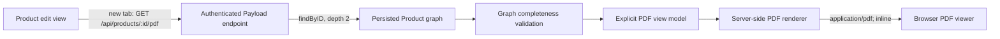

# ADR: Generate Readable Product PDFs on Demand

**Status:** Proposed  
**Date:** 2026-07-29  
**Decision scope:** Product configuration review in the Payload admin

## Context

Product administrators need a readable representation of a complete Product configuration without validating every nested field in the Payload form. The Product schema spans general data, clinical safety, presentations, reconstitution details, and protocols with related catalog records.

The current application uses Payload 3.85.1, Next.js 16.2.6, and React 19.2.6. Products are defined in `src/collections/Products.ts`; there is no current Product PDF endpoint or PDF runtime dependency. The existing Payload REST catch-all remains the API entry point.

The PDF must represent only the latest persisted state. It is a review view, not a historical record, approval artifact, or substitute for saving the Product.

## Decision

Provide an authenticated collection endpoint:

```http
GET /api/products/:id/pdf
```

The endpoint will load the Product with Payload Local API access at `depth: 2`, map it into an explicit PDF view model, validate that all required relationships are populated, and render a section-based PDF on demand.

Use `@react-pdf/renderer` server-side as the preferred renderer, subject to a compatibility spike against the repository's React 19 and Next.js 16 runtime before adding the dependency. Use its Node API (`renderToBuffer` initially, or `renderToStream` when response size justifies streaming) and return the result inline. Do not persist the generated file in Payload.

The PDF contains no raw JSON appendix. It includes every clinical and functional Product field, plus Product-level audit metadata, while intentionally omitting internal IDs and timestamps from related catalog records.

## Decision details

### Data flow



The endpoint should load the record through the request context:

```ts
req.payload.findByID({
  collection: 'products',
  id,
  depth: 2,
  req,
  overrideAccess: false,
})
```

This is a proposed implementation shape, not existing behavior.

### Document structure and field mapping

The renderer uses a stable, explicit mapping so reviewers can compare products consistently.

1. **Header and traceability**
   - Canonical product name
   - Product ID
   - Validation status
   - Validation notes
   - Created date and last modified date
2. **General**
   - Product type
   - Laboratory name
   - Active ingredient names
   - Product aliases
3. **Clinical Safety**
   - Contraindication description and type
   - Adverse effect descriptions
4. **Presentations**
   - Canonical presentation name and status
   - Presentation aliases
   - Clinical notes
   - Reconstitution: diluent type, volume, and instructions
   - Protocols, including name, zones, administration routes, techniques, minimum and maximum sessions, and frequency

Related records contribute their clinical or functional fields only. Their internal IDs, `createdAt`, and `updatedAt` values are omitted. Product-level `id`, `createdAt`, and `updatedAt` remain visible for traceability.

The mapping must track the Product schema. A schema change that adds a clinical or functional field requires a corresponding mapper and coverage update; unknown fields must not be silently represented as if the PDF were complete.

### Validation status treatment

- `PENDING`: render **“PENDIENTE DE VALIDACIÓN — NO APROBADO”** as a fixed notice on every page.
- `APPROVED`: render a discreet **“Aprobado”** badge in the document header, without the pending warning treatment.

The PDF communicates current status only. Generating or viewing it does not change validation state.

### Empty and incomplete data

- Render missing scalar values as **“No informado”**.
- Render empty collections as **“Sin registros”**.
- Never print JavaScript `null`, `undefined`, an empty object, or an unexplained blank cell.
- Treat an unpopulated relationship where an object is expected—for example, a numeric zone, route, or technique ID—as a graph completeness error. Return an error response instead of generating a partial or misleading PDF.

`depth: 2` is required because `depth: 1` can leave protocol zones, routes, and techniques as IDs.

### HTTP behavior

Successful responses use:

```http
Content-Type: application/pdf
Content-Disposition: inline; filename="<sanitized-product-name>.pdf"
Cache-Control: private, no-store
X-Content-Type-Options: nosniff
```

The filename must be sanitized for header safety and filesystem portability. An RFC 5987 `filename*` value may preserve the UTF-8 canonical name while retaining a safe ASCII fallback.

Error responses must be concise and must not return a malformed or partial PDF:

| Condition | Response |
| --- | --- |
| No authenticated Payload user | `401 Unauthorized` |
| Invalid Product ID | `404 Not Found` |
| Missing or inaccessible Product | `404 Not Found` |
| Relationship graph is not fully populated | Server error with a stable, supportable message |
| Render failure | Server error; log diagnostic context without dumping clinical content |

### Security and access control

- Keep the endpoint same-origin with the Payload admin and reuse the authenticated request session.
- Perform explicit authentication before rendering.
- Pass `req` and `overrideAccess: false` to `findByID` so collection access rules remain authoritative.
- Do not fetch from a public REST URL within the server; use Payload's request-bound Local API.
- Do not persist the PDF, create public file URLs, or place generated bytes in a shared cache.
- Validate the route ID and escape every user-managed string through the renderer's text primitives.
- Sanitize the `Content-Disposition` filename independently from displayed content.
- Avoid logging the complete Product payload or generated document.

## Options considered

### 1. `@react-pdf/renderer` on the server — recommended

**Advantages**

- Declarative components suit nested, repeatable sections such as presentations and protocols.
- Built-in page wrapping and fixed elements support the repeated pending-status notice.
- Node rendering APIs support on-demand responses without a browser runtime.
- Layout code can be decomposed and tested around a typed view model.

**Tradeoffs**

- It is a new production dependency.
- Compatibility with this repository's React 19 and Next.js 16 versions must be proven before adoption.
- Complex print layout and fonts still require explicit pagination and typography tests.

References: [React-pdf documentation](https://react-pdf.org/) and [React-pdf repository](https://github.com/diegomura/react-pdf).

### 2. HTML print view rendered by Playwright

**Advantages**

- Reuses HTML and CSS knowledge.
- Browser print CSS can closely match a web preview.

**Tradeoffs**

- Requires a browser binary and a substantially heavier runtime path.
- Increases cold-start, memory, deployment, and operational complexity.
- The repository's current Playwright dependency is development-only and should not become an implicit production PDF service.

This option is not selected for the initial implementation.

### 3. Low-level generation with PDFKit or pdf-lib

**Advantages**

- Direct control over PDF primitives and potentially fewer React integration concerns.
- Appropriate for precise drawing, modification, stamping, or form operations.

**Tradeoffs**

- Requires manual layout, wrapping, pagination, repeating headers, and nested-section flow.
- Completeness and readability become harder to maintain as the Product schema grows.
- `pdf-lib` is oriented more toward creating and modifying primitives than flowing long business documents.

Use this only if the React-pdf compatibility spike fails and a narrower renderer can meet the layout requirements.

## Non-functional requirements

- **Correctness:** Generate from one request-bound, persisted Product snapshot and never mix unsaved form state.
- **Completeness:** Validate the populated graph before rendering and cover every functional mapper field with tests.
- **Readability:** Use predictable section hierarchy, page breaks, repeated status treatment, and page numbers; prevent rows and headings from becoming orphaned where the renderer permits.
- **Privacy:** Do not cache or persist generated bytes; apply the same access rules as Product reads.
- **Reliability:** Fail atomically—return either a valid PDF or a non-PDF error response.
- **Performance:** Benchmark with the largest representative Product during the compatibility spike. Keep the initial buffer approach only while its memory profile remains acceptable.
- **Accessibility:** Use clear labels and sufficient status contrast. The initial artifact is intended for visual review and printing; tagged-PDF accessibility requires separate validation before making compliance claims.

## Test strategy

Strict TDD applies. Add failing tests before endpoint and component implementation.

### Endpoint and access tests

- Unauthenticated request returns `401`.
- Missing, invalid, or inaccessible Product returns `404`.
- The Local API query uses `depth: 2`, `req`, and `overrideAccess: false`.
- A successful response starts with the `%PDF` signature.
- Successful headers include `application/pdf`, inline disposition, `private, no-store`, and `nosniff`.
- Header filename sanitization rejects control characters and unsafe path characters.

### Data completeness and rendering tests

- An AEC fixture covers all Product-level fields and every nested functional field.
- The rendered view model contains General, Clinical Safety, Presentations, Reconstitution, and complete Protocol data.
- Relationship IDs that remain numeric where populated objects are required cause generation to fail.
- `null` scalar values render as **“No informado”**.
- Empty arrays render as **“Sin registros”**.
- `PENDING` renders the required warning on every page.
- `APPROVED` renders the discreet badge and omits the pending warning.
- Related-record IDs and timestamps do not appear in the view model or rendered text.

### Admin component tests

- The action is hidden on Product creation.
- The action is enabled for a clean, persisted Product.
- The action is disabled for a dirty form and explains that changes must be saved.
- Selecting it targets the same-origin endpoint in a new tab with `noopener noreferrer`.

### Compatibility spike gate

Before installing the renderer in the implementation change:

1. Render a representative multi-page AEC fixture using the actual repository versions of Node, React, and Next.js.
2. Verify server-only bundling and the selected Node rendering API.
3. Verify page wrapping, repeated `PENDING` notices, accented Spanish text, and nested protocols.
4. Measure render time and memory for a largest-representative fixture.
5. Record a go/no-go result. If no-go, evaluate the low-level option against the same fixture and requirements.

## Consequences

### Positive

- Administrators get one consistent, printable view of the complete persisted Product.
- Explicit missing-value labels make configuration gaps visible.
- Request-bound access control avoids creating a second public data path.
- On-demand generation prevents stale files and storage lifecycle concerns.
- A dedicated view model separates schema completeness from PDF layout.

### Negative

- Generation consumes server CPU and memory on every request.
- A new PDF dependency and font/layout behavior must be maintained.
- Schema evolution requires deliberate updates to the view model, renderer, and completeness tests.
- The output is not evidence of what a Product looked like at an earlier time.

## Out of scope

- Persisting PDFs in Payload or another storage service
- Historical versioning or immutable audit snapshots
- Digital signatures, approval certificates, or evidentiary records
- A raw JSON appendix
- Generating from unsaved form state
- Automatic download instead of inline browser viewing

## Action items

1. Complete and record the React-pdf compatibility spike.
2. Define a typed Product PDF view model and graph validator.
3. Add the endpoint tests and AEC completeness fixture first.
4. Implement the authenticated collection endpoint and server renderer.
5. Add the client action through `beforeDocumentControls` with dirty-form safeguards.
6. Add component tests and verify the full flow in the Payload admin.

