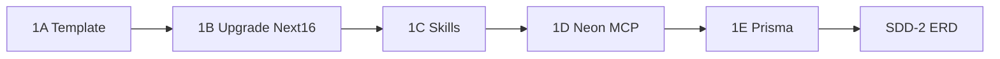

# Plan de migración: faq-agent → clinical-agent

## Secuencia acordada (grill-me en curso)

1. **Ahora:** SDD-1 `clinical-platform-scaffold` dividido en **5 sub-fases** (1A→1E)
2. **Después:** SDD-2 colecciones Payload desde [`docs/erd_dominio_clinico.mmd`](c:\git_root\faq-agent\docs\erd_dominio_clinico.mmd)
3. **Luego:** SDD-3 … SDD-6 (migración de datos + agente)

## Decisiones confirmadas

| Decisión | Valor |
|----------|-------|
| Repo | `c:\git_root\clinical-agent` **ya creado** (git init hecho) |
| Arquitectura | App Next.js **unificada** (chat + Payload admin + Local API) |
| Stack objetivo | Next **16.2.x**, React **19**, Payload **3.85+**, Postgres Neon |
| Fuente de schema (SDD-2) | **ERD clínico** (`erd_dominio_clinico.mmd`), no copiar `Products.ts` de faq-agent tal cual |
| Post-template | Upgrade explícito con `/next-best-practices` + skill `next-upgrade` |

## Estado del repo clinical-agent (audit 2026-06-22)

**Hecho manualmente por el usuario:**

| Sub-fase | Estado | Evidencia |
|----------|--------|-----------|
| **1A Template** | ✅ | `package.json`, `src/`, `(frontend)` + `(payload)`, Postgres adapter en `payload.config.ts` |
| **1B Upgrade** | 🟡 Parcial | Versiones ya en target: Next 16.2.6, React 19.2.6, Payload 3.85.1. Falta: codemod async APIs, `serverExternalPackages: ['sharp']` |
| **1C Skills** | 🟡 Parcial | Skills en `.agent/skills/` y `.claude/skills/` (payload, next-best-practices, neon-postgres, ai-sdk, grill-me, etc.). `CLAUDE.md` apunta a payload. **Falta:** `AGENTS.md`, `openspec/`, `docs/erd_dominio_clinico.mmd` |
| **1D Infra** | ❌ | `.env.example` aún dice **MongoDB** (bug del template); `plugins: []` sin MCP; sin scripts `db:migrate` |
| **1E Prisma** | ❌ | Sin `prisma/` ni dependencias |

**Decisión grill-me (1C):** Skills instaladas **manualmente** en `.agent/skills/` + `.claude/skills/` (no `npx skills add`).

**Audit adicional (2026-06-22 — prep SDD-2):**

| Aspecto | Estado | Acción |
|---------|--------|--------|
| `payload.config.ts` | Postgres adapter, colecciones `users` + `media` | OK para template |
| `@payloadcms/plugin-mcp` | En `package.json`, **no** en `plugins: []` | Wire en 1D |
| `src/migrations/` | **No existe** | Generar tras limpiar BD |
| `src/scripts/` | **No existe** | Copiar `list-db-tables`, `drop-payload-tables`, `run-migrate*` de faq-agent |
| `.env` | Existe (Neon) | No commitear |
| `.env.example` | Sigue MongoDB | Corregir a Postgres |
| `docker-compose.yml` / `README.md` | Sigue MongoDB | Ignorar o actualizar (no usar docker mongo) |
| `docs/` | No existe | Copiar ERD en 1C |

**Limpieza BD antes de SDD-2:** Si `DATABASE_URL` apunta al mismo Neon que `faq-agent/apps/cms`, quedan tablas legacy (`categories`, `products`, `payload_users`, etc.). Para schema ERD limpio: **DROP CASCADE de todas las tablas Payload** y re-migrar solo `users` + `media` hasta SDD-2.

---

# SDD-1: `clinical-platform-scaffold` (5 sub-fases)

Ciclo OpenSpec por sub-fase o un solo ciclo SDD con tasks agrupadas — **recomendación:** un SDD con 5 tasks verificables (1A→1E).



## SDD-1A — Template Payload (`scaffold-template`)

**Objetivo:** App blank + Postgres en el repo existente.

```powershell
cd c:\git_root\clinical-agent

# Preservar archivos existentes; template escribe package.json, src/, etc.
pnpm dlx create-payload-app@latest . --db postgres --template blank

pnpm install
git add -A && git commit -m "chore: scaffold Payload 3 blank + postgres"
```

**Criterio de salida:** `pnpm dev` arranca (aunque falle DB hasta 1D).

**Decisión grill-me (1A):** Scaffold en raíz `.` preservando `tareas_migracion_dev_jr.md`, `.mcp.json`, `.atl/`. Si el CLI rechaza directorio no vacío, usar `--force` o responder prompts aceptando merge (no borrar docs existentes).

---

## SDD-1B — Upgrade stack Next 16 (`scaffold-upgrade`)

**Objetivo:** Alinear con últimas versiones estables; el template suele traer versiones anteriores.

```powershell
# Pin al stack de referencia faq-agent/cms
pnpm add next@16.2.6 react@19.2.6 react-dom@19.2.6 payload@3.85.1 \
  @payloadcms/next@3.85.1 @payloadcms/db-postgres@3.85.1 \
  @payloadcms/richtext-lexical@3.85.1 @payloadcms/ui@3.85.1

pnpm add -D eslint-config-next@16.2.6 typescript@5.7.3

# Async APIs (params, cookies, headers) — next-best-practices
pnpm dlx @next/codemod@latest next-async-request-api .

# next.config — bundling best practices
# serverExternalPackages: ['sharp']
# (Payload ya depende de sharp)
```

**Checklist next-best-practices:**
- [ ] `params` / `searchParams` como `Promise<>` en pages y route handlers
- [ ] `await cookies()` / `await headers()` donde aplique
- [ ] Runtime default Node.js (no Edge en Payload routes)
- [ ] RSC boundaries: chat UI en `'use client'`, data en server
- [ ] `serverExternalPackages: ['sharp']` en `next.config`

**Criterio de salida:** `pnpm build` sin errores de tipos async.

---

## SDD-1C — Skills y toolchain agente (`scaffold-skills`)

**Objetivo:** Skills **repo-local** (no depender solo del registry global `.atl/`).

### Skills obligatorias (copiar o instalar en repo)

| Skill | Propósito | Instalación |
|-------|-----------|-------------|
| `payload` | Colecciones, hooks, Local API, MCP | Copiar desde `faq-agent/.agents/skills/payload/` |
| `next-best-practices` | Convenciones Next 16 post-upgrade | Copiar desde `faq-agent/.claude/skills/next-best-practices/` |
| `neon-postgres` | Neon setup, branches, connection strings | `npx skills add neondatabase/agent-skills --skill neon-postgres -y` |
| `next-upgrade` | Codemods y migraciones Next | `npx skills add vercel/agent-skills --skill next-upgrade -y` (o copiar) |
| `tdd` | TDD obligatorio (openspec) | Copiar desde faq-agent `.agents/skills/tdd/` |
| `ai-sdk` | Chat agent pipeline | `npx skills add vercel/agent-skills --skill ai-sdk -y` |
| `vercel-react-best-practices` | Performance React/Next | Copiar `.agents/skills/vercel-react-best-practices/` |
| `extract-product` | Extracción (adaptar en SDD-4) | Copiar `.claude/skills/extract-product/` |
| `clinical-resolver` | Revisión clínica Dra. Sara | Copiar `.agents/skills/clinical-resolver/` |
| `grill-me` / `grill-with-docs` | Diseño iterativo | Copiar o skills add |

### Estructura repo-local

```
clinical-agent/
├── .agents/skills/          # Cursor / agents
├── .claude/skills/          # Claude Code
├── AGENTS.md                # Registry de skills + convenciones (desde faq-agent, adaptado)
├── openspec/config.yaml     # strict_tdd: true
└── docs/
    └── erd_dominio_clinico.mmd   # Copiar desde faq-agent
```

```powershell
# Docs de dominio
mkdir docs
copy c:\git_root\faq-agent\docs\erd_dominio_clinico.mmd docs\
copy c:\git_root\faq-agent\CONTEXT.md .
copy c:\git_root\faq-agent\PLAN_MIGRACION.md docs\

# Skills payload + next-best-practices (xcopy /E /I ...)
# AGENTS.md + openspec/config.yaml desde faq-agent (adaptar rutas)
```

**Criterio de salida:** `AGENTS.md` lista skills con paths repo-local; ERD presente en `docs/`.

---

## SDD-1D — Infra Neon + MCP (`scaffold-infra`) — **SIGUIENTE**

Checklist concreto dado el estado actual del repo:

```powershell
cd c:\git_root\clinical-agent

# 1. Neon (si no está linkeado)
npx -y neonctl@latest init --agent cursor

# 2. Corregir .env.example (hoy dice MongoDB — debe ser Postgres Neon)
# DATABASE_URL=postgresql://...@...neon.tech/neondb?sslmode=require
# PAYLOAD_SECRET=
# PAYLOAD_MCP_API_KEY=

# 3. MCP plugin
pnpm add @payloadcms/plugin-mcp
# payload.config.ts — copiar patrón de faq-agent/apps/cms (permisos granulares)
# src/scripts/setup-mcp-api-key.ts

# 4. Scripts migrate (copiar de faq-agent/apps/cms)
# package.json: db:migrate:create, db:migrate

pnpm payload migrate:create
pnpm payload migrate
pnpm payload generate:types
pnpm dev   # → /admin login OK
```

**Criterio de salida 1D:** `/admin` funcional contra Neon; `.env.example` corregido; MCP plugin configurado.

### Limpieza BD (bloqueante para SDD-2)

Si la Neon compartida tiene schema de `faq-agent/cms`, ejecutar **después** de agregar scripts:

```powershell
cd c:\git_root\clinical-agent

# 1. Ver tablas actuales
pnpm exec tsx --env-file=.env src/scripts/list-db-tables.ts

# 2. Drop total Payload (incluye categories/products legacy de faq-agent)
pnpm exec tsx --env-file=.env src/scripts/drop-payload-tables.ts

# 3. Regenerar migración inicial del template (users + media)
pnpm exec tsx --env-file=.env src/scripts/run-migrate-create.ts
pnpm exec tsx --env-file=.env src/scripts/run-migrate.ts
pnpm payload generate:types
```

Tablas a eliminar (lista de faq-agent + template): `categories*`, `products*`, `payload_users*`, `media`, `payload_migrations`, `payload_kv`, `payload_locked_documents*`, `payload_preferences*`, enums Payload huérfanos.

**No tocar** tablas Prisma (`users`, `sessions`, `messages`, `feedbacks`) si ya existen — aún no hay Prisma en clinical-agent.

**Alternativa nuclear (Neon dev branch):** `neonctl branches create --name clean-sdd2` + nuevo `DATABASE_URL` — más seguro si hay datos que conservar.

---

## SDD-1E — Prisma sesiones (`scaffold-prisma`)

Convive con Payload en **misma** `DATABASE_URL` (tablas distintas: `payload-users` vs `users`).

```powershell
pnpm add prisma @prisma/client
pnpm prisma init
# schema: copiar faq-agent/apps/agent/prisma/schema.prisma
pnpm prisma migrate dev --name init_chat
```

**Decisión grill-me (1E):** Prisma **incluido en SDD-1** — schema chat migrado en la misma Neon DB antes de SDD-2.

---

## Comandos SDD-1 (invocación)

```
/sdd-init clinical-platform-scaffold
/sdd-explore
/sdd-propose
/sdd-spec
/sdd-design
/sdd-tasks    # tasks 1A–1E
/sdd-apply
/sdd-verify   # pnpm build && pnpm dev && /admin
/sdd-archive
```

---

# SDD-2+: visión (post-scaffold, no ejecutar aún)

## SDD-2 — `payload-clinical-schema` (desde ERD)

Fuente: [`erd_dominio_clinico.mmd`](c:\git_root\faq-agent\docs\erd_dominio_clinico.mmd)

Entidades ERD → colecciones Payload (grill-me en SDD-2 decidirá híbrido vs normalizado):

| ERD | Payload (propuesta inicial) |
|-----|----------------------------|
| `laboratorio` | `laboratories` |
| `ingrediente_activo` | `active-ingredients` |
| `producto` | `products` (+ `validationStatus`, `validationNotes`) |
| `producto_ingrediente_activo` | join en producto o array relacional |
| `presentacion_comercial` | array `presentaciones[]` embebido + **join fields** Payload para admin |
| `zona_aplicacion`, `via_administracion`, `tecnica_aplicacion` | taxonomías maestras |
| `protocolo_aplicacion`, `reconstitucion_dilucion` | embebidos en presentación (UX doctora) |
| `contraindicacion`, `efecto_adverso` | nivel producto |
| `indicacion_clinica`, `cuidados_post_aplicacion`, `advertencia_seguridad` | nivel presentación |
| `combinacion_efectiva` | **Diferido** (SDD-2b); sinergias siguen en Categories richText por ahora |
| `sinonimo` | aliases en producto/presentación |

**Nota:** El ERD es más normalizado que el `Products.ts` actual de faq-agent. SDD-2 reconciliará ERD vs decisiones previas de [PLAN_MIGRACION.md](PLAN_MIGRACION.md) (modelo híbrido embebido para UX).

## SDD-3 … SDD-6

Sin cambios respecto al plan anterior (seed → extractor → loader → agent tools).

---

# SDD globales: 6 flujos + 5 sub-fases en SDD-1

| SDD | Nombre | Scope |
|-----|--------|-------|
| **1** | `clinical-platform-scaffold` | **1A–1E** (este documento) |
| **2** | `payload-clinical-schema` | ERD → colecciones |
| **3** | `taxonomy-seed` | Seeds + lookups |
| **4** | `product-extractor-local` | JSON intermedios |
| **5** | `payload-loader-mcp` | Ingesta MCP |
| **6** | `agent-payload-tools` | Local API + evals |

Revisión clínica (Dra. Sara) = operación humana entre SDD-5 y SDD-6.

---

# Grill-me: decisiones cerradas y pendientes

**Cerradas (SDD-1):**
- **1A:** Scaffold en raíz `.` preservando archivos existentes
- **1E:** Prisma en SDD-1 (no diferir)

**Cerradas (SDD-2 preview):**
- **Presentaciones:** Híbrido — array `presentaciones[]` embebido + join fields Payload
- **Combinaciones efectivas:** Diferidas (SDD-2b / post-MVP); v1 = producto + presentación + taxonomías
- **1C Skills:** Instalación manual en `.agent/` + `.claude/`
- **Orden SDD-1 restante:** **1D → 1B → 1C docs → 1E** (1D elegido como siguiente paso)
