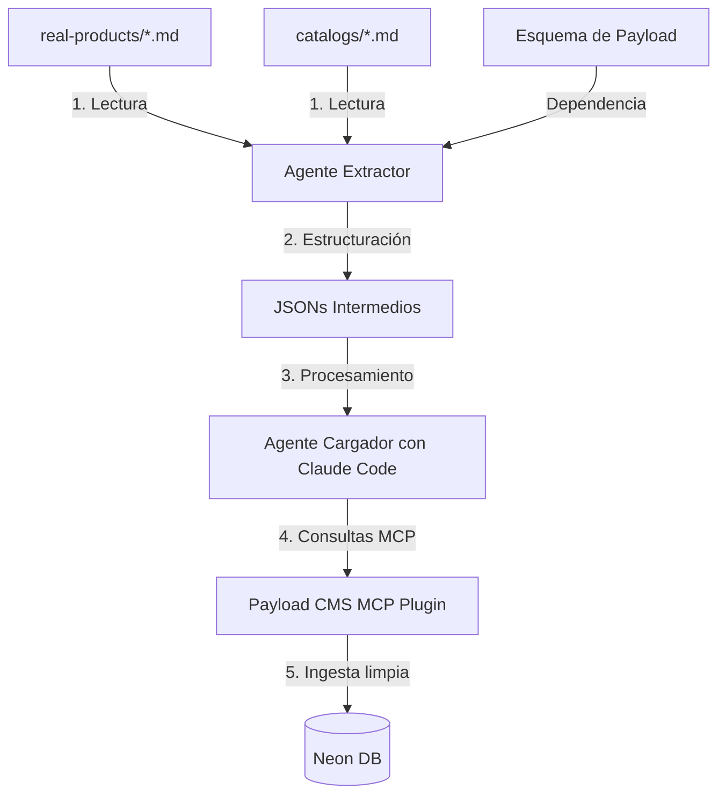

# Tareas de Migración: Diseño de Agentes para Payload CMS

Este documento contiene las especificaciones y guías de desarrollo de las dos tareas de migración asignadas para el desarrollador junior. El objetivo es estructurar la migración en dos fases independientes para reducir la complejidad técnica y garantizar la calidad clínica de los datos.

---

## Flujo General de la Migración

---

## Tarea 1: Agente Extractor (Fase de Estructuración Local)

### Descripción
Diseñar e implementar un agente o script extractor encargado de leer los datos clínicos crudos y transformarlos en documentos JSON estructurados. Este agente debe funcionar localmente, sin interactuar directamente con la base de datos de Payload, operando 100% sobre archivos.

> [!IMPORTANT]
> **Bloqueo/Dependencia:** Esta tarea solo puede ejecutarse cuando las colecciones y esquemas finales de Payload estén completamente definidos en el código del CMS (Phase 2 del plan de migración). El esquema de base debe actuar como la plantilla de salida del extractor.

### Responsabilidades y Reglas de Negocio
1. **Mapeo del Esquema:** Mapear los datos de origen (`apps/agent/lib/data/real-products/*.md` y `apps/agent/lib/data/catalogs/*.md`) al esquema de variantes híbrido definido para Payload.
2. **Normalización Estricta:**
   - Convertir el campo `canonicalName` a Mayúsculas Sostenidas (UPPERCASE).
   - Normalizar espacios y limpiar caracteres extraños.
3. **Cero Alucinación (Grounding):**
   - Extraer **únicamente** lo que los archivos de origen declaren de forma explícita.
   - Si un campo no está definido, debe quedar como `null` en el JSON resultante. Nunca asumas dosificaciones, concentraciones o datos médicos genéricos.
4. **Flujo de Validación Clínica:**
   - Si un producto de origen presenta ambigüedades, valores inconsistentes o le falta información obligatoria (por ejemplo, volumen de reconstitución o dosis de protocolo), el agente debe marcar el estado en el JSON:
     - `validationStatus: "NEEDS_CLINICAL_REVIEW"`
     - Redactar detalladamente la anomalía en `validationNotes` para que la Dra. Sara pueda resolverlo después en la interfaz visual.
   - Si el producto está completo y sin dudas, setear `validationStatus: "PENDING"` o `validationStatus: "APPROVED"` (según directiva de la clínica).

### Entradas y Salidas
* **Entradas:**
  - Archivos Markdown de productos reales: `apps/agent/lib/data/real-products/*.md`
  - Catálogos clínicos de categorías: `apps/agent/lib/data/catalogs/*.md`
  - Esquema final de la colección `Products` de Payload (definido en TypeScript/JSON).
* **Salidas:**
  - Un directorio de archivos JSON individuales (uno por cada línea de producto) guardados temporalmente en `tmp/migration/extracted/`.
  - Estructura del JSON debe coincidir 1:1 con los campos requeridos por Payload.

### Criterios de Aceptación
- [ ] El extractor procesa las 66 fichas comerciales de origen sin abortar por errores de formato.
- [ ] Cada JSON resultante valida correctamente contra el esquema de TypeScript de la colección de Payload.
- [ ] No se pierde información textual al convertir los bloques clínicos a texto plano en español (no usar estructuras Lexical complejas de Payload, solo strings planos).
- [ ] Todos los nombres de variantes y productos están normalizados.

---

## Tarea 2: Agente Cargador (Fase de Ingesta vía Claude Code + MCP)

### Descripción
Diseñar el agente cargador que tomará los JSONs intermedios generados por el Agente Extractor e insertará/actualizará los datos en el CMS usando **Claude Code** y el plugin MCP de Payload CMS (`@payloadcms/plugin-mcp`).

> [!NOTE]
> Esta fase asume que las tablas maestras de taxonomías ya han sido pre-pobladas (Zonas, Vías, Técnicas, Categorías). El cargador debe ser inteligente para enlazar estas relaciones a través de consultas.

### Responsabilidades y Lógica de Ingesta
1. **Resolución Relacional Dinámica:**
   - Los JSONs intermedios del extractor referencian categorías, laboratorios e ingredientes activos por nombre (ej: `"Laboratorio": "Galderma"`).
   - El agente cargador debe realizar búsquedas previas en las colecciones relacionales de Payload (ej: `Laboratories`, `Categories`, `ActiveIngredients`) para obtener sus **IDs numéricos/UUIDs** correspondientes en base de datos.
   - Si una colección maestra de soporte (como `Laboratories` o `ActiveIngredients`) no tiene el elemento registrado, el cargador debe crearlo primero y luego usar ese nuevo ID.
   - **Excepción:** La colección `Categories` es de solo lectura y estricta. Si la categoría no existe en Payload, el agente debe detenerse y reportarlo.
2. **Estrategia de Upsert Seguro:**
   - Buscar el producto en base de datos por `canonicalName` (en mayúsculas) usando la herramienta `findProducts`.
   - **Si el producto no existe:** Ejecutar `createProducts` enviando el payload completo (inicializando `active: true` y `protocolEnabled: false`).
   - **Si el producto existe:**
     - Obtener el ID del producto existente.
     - Realizar un `updateProducts` **apuntando directamente al ID del documento**.
     - > [!WARNING]
       > **JAMÁS pasar una cláusula `where` general en un `updateProducts`**, ya que eso ejecuta actualizaciones masivas inseguras sobre la base de datos de Payload.
3. **Preservación de Variantes y Aliases (Full Replace Guard):**
   - El array de `variants` se reemplaza por completo en cada actualización.
   - El cargador debe recuperar los `aliases` curados manualmente de las variantes existentes en la base de datos antes de pisarlas, y unirlos con los nuevos aliases extraídos para no perder el trabajo humano previo.

### Herramientas Permitidas del MCP
* `findCategories` (solo lectura)
* `findProducts` / `createProducts` / `updateProducts` (por ID)
* Herramientas de consulta y creación de maestros (`Laboratories`, `ActiveIngredients`, `Zones`, `Routes`, `Techniques`).
* **Prohibido:** Herramientas de configuración del CMS, eliminación de colecciones, manipulación de esquemas o alteración de credenciales.

### Criterios de Aceptación
- [ ] El agente procesa secuencialmente la cola de JSONs desde `tmp/migration/extracted/`.
- [ ] Resuelve correctamente todas las relaciones relacionales de manera asíncrona antes de guardar el producto.
- [ ] Implementa correctamente el resguardo de aliases de variantes en actualizaciones.
- [ ] No genera duplicados lógicos en la base de datos de Neon.
- [ ] Genera un log al finalizar reportando qué productos se crearon, cuáles se actualizaron y cuáles fallaron con sus motivos correspondientes.
